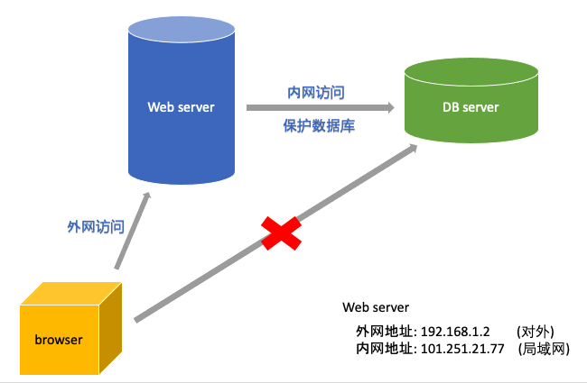
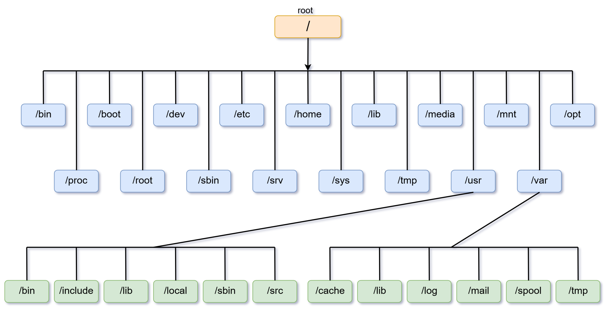

# Linux

0. 小型云服务网站架构

1. linux 文件与目录结构 (万物皆文件)

        - /bin, /usr/bin, /usr/local/bin
            是Binary的缩写, 这个目录存放着最经常使用的命令
            其下的所有指令在linux下的任意位置都能访问, 因为默认就配置在$PATH环境变量中
        
        - /sbin, /usr/sbin, /usr/local/sbin
            s代表super user, 这里存放的是系统管理员才能使用的系统管理命令/程序
            其下的所有指令在linux下的任意位置都能访问, 因为默认就配置在$PATH环境变量中
        
        - /home
            存放普通用户的家目录, 在linux中每个用户都有一个自己的目录, 该目录名是以用户的账号命名的
        
        - /root
            该目录为系统管理员, 也称作超级权限者的用户主目录
            
        - /lib
            系统开机所需要最基本的动态连接共享库, 几乎所有的应用程序都需要用到这些共享库
            
        - /lost+found
            这个目录一般情况下是空的, 当系统非法关机后, 这里就存放了一些文件
            
        - /etc (often use)
            所有系统管理所需要的配置文件和子目录
        
        - /usr
            非常重要的目录, 用户的很多应用程序和文件都放在这个目录下
        
        - /boot (NO touch)
            存放启动linux时使用的一些核心文件, 包括一些连接文件以及镜像文件, 自己安装的不放在这里
        
        - /proc (NO touch)
            虚拟目录, 系统内存的映射, 可以通过直接访问这个目录来获取系统信息
        
        - /srv (NO touch)
            service缩写, 存放一些服务启动之后需要提取的数据
            
        - /sys (NO touch)
            这是linux2.6内核的一个很大的变化, 该目录下安装了2.6内核中新出现的一个文件系统 sysfs
        
        - /tmp
            这个目录用来存放临时文件
        
        - /dev
            设备管理器, 把所有的硬件利用文件的形式进行管理
            
        - /media
            linux系统会自动识别一些设备, 例如U盘, 光驱等等, 当识别后, linux会把识别的设备挂载到这个目录下
            
        - /run
            进程产生的临时文件, 虚拟机加载光盘映像在: /run/media/root/目录下
        
        - /mnt
            系统提供该目录是为了让用户临时挂载别的文件系统的, 我们可以将外部的存储挂载在/mnt/上, 然后进入该目录就可以查看里面的内容了
        
        - /opt (mostly use)
            这是给主机额外安装软件所摆放的目录, 比如安装一个Oracle数据库则可以放在这个目录下, 默认是空哒
        
        - /usr/local (often use)
            这是另一个给主机额外安装软件所摆放的目录, 一般是通过编译源码的方式安装的程序
        
        - /var
            这个目录存放着在不断扩充着的东西, 习惯将那些经常被修改的目录放在这个目录下, 包括各种日志文件
            
            
2. 网络类型 -- 配置linux

        a. 桥接网络
            linux和主机共用一个网段, 
                eg: 主机:192.168.1.120, 虚拟机:192.168.1.121, 
                使得主机可以和虚拟机通信
            问题:
                - 主机所在的局域网的ip冲突不够用, 因为1-255数量有限
                - 不安全: 同局域网网段的其他机器(eg: 192.168.1.220, 192.168.1.221)也可以访问linux, 但linux一般作为服务器, 所以不能被随意访问
            
        b. 网络地址转换(NAT) -- 最理想
            linux不和主机共用一个网段,
                eg: 主机:192.168.1.120, 虚拟机:172.16.212.3
            因此不会出现ip冲突不够用的问题, 而且局域网的其他主机也不能随意访问linux
            主机与虚拟机通信的新方式: 
                - 虚拟机会另外提供两个虚拟网卡(eg:nvnet8的网关: 172.16.212.1), 虚拟网卡中的一个一定会与linux在同一个网段

        c. 仅主机模式网络
            只有linux和主机在同一个网络中, 但不和主机所在的局域网在同一个网络中, 因此此时的虚拟机不具备联网功能
            
        d. 不使用网络
